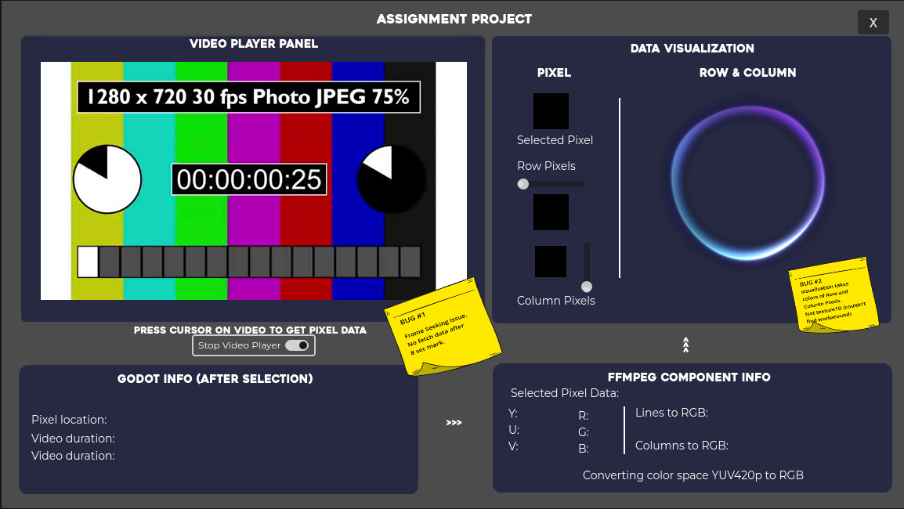
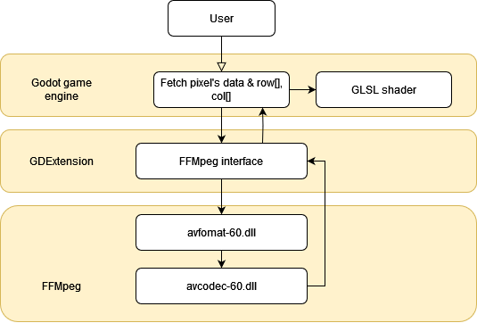
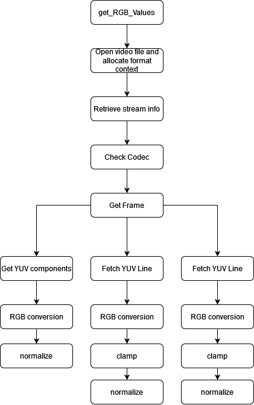
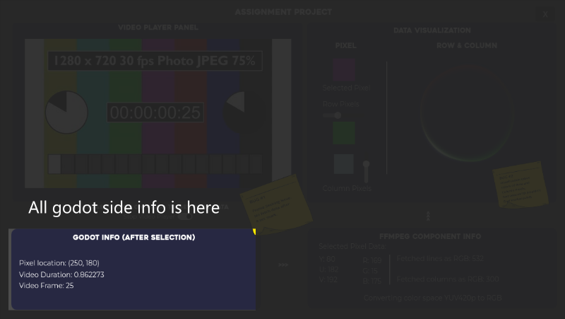
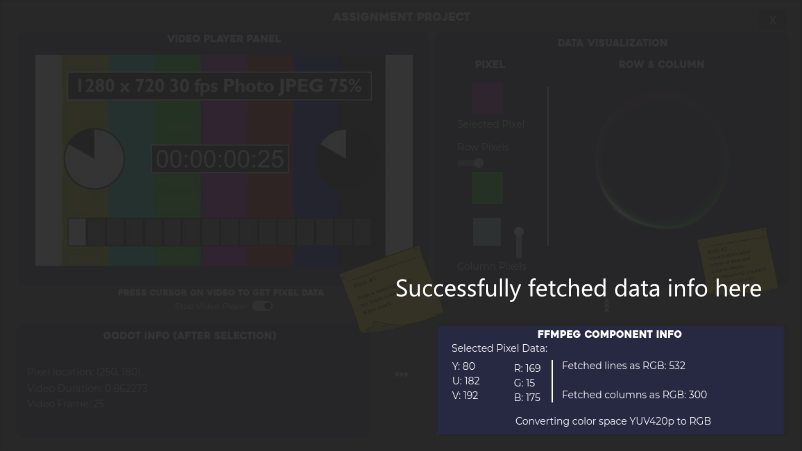
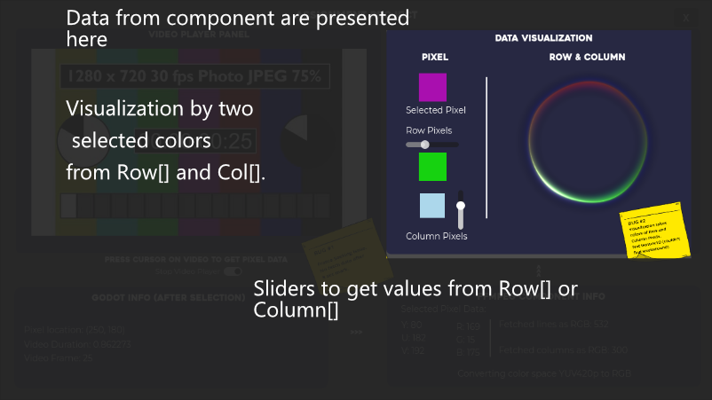

# Assignment Project

## Project Overview
`Assignment Project` is a Godot project designed to extract and return the raw values (RGB struct) of a selected pixel. It then visualizes these values using a GLSL shader.

## Project Structure
The project is divided into two main parts:
- **Source:** This folder contains the main Godot project files and a C++ project for integrating FFMpeg and all dependencies.
- **Builds:** This folder includes the built versions of the Godot project, alongside FFMpeg dynamic libraries and test video.
- **Doc:** This folder includes material used for readme

Shortcuts:
- C++ component code is on [Source/src](Source/src/) folder. Main code is on [gdexample.h ](Source/src/gdexample.h) and [gdexample.cpp ](Source/src/gdexample.cpp)
- 
- Source/dependencies: dependencies for FFMpeg.
- Source/src: C++ component code. Main code is on gdexample.h and gdexample.cpp 

## Project Architecture
**Full system architecture**

**Main algorithm diagram**

## How to use it

## KNOWN BUG and lack of feature

**#1**
RGB values being off and increasing offset over the duration of the video, espacially leading to no RGB values being obtainable after a certain point.
I suspect this issue may be related to my use of frame seeking. When seeking to a specific frame, it's possible that it does not land precisely on the requested frame.

**#2**
The task was to visualize row[] and col[] as 1D textures. However, Godot does not yet support 1D textures, and despite attempting various workarounds, I have not been able to resolve this issue. As an alternative, I have implemented a shader that visualizes animation using two colors selected by the user from row[] and col[].
